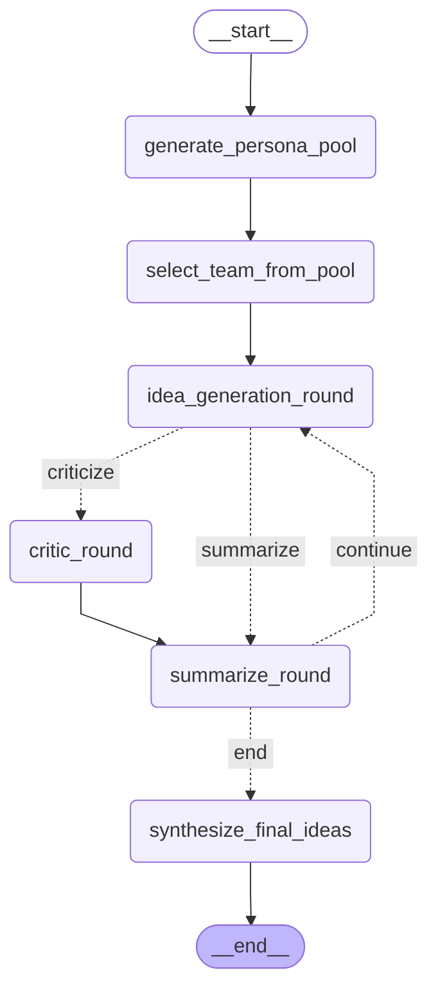

```mermaid
---
config:
  flowchart:
    curve: linear
---
graph TD;
	__start__([<p>__start__</p>]):::first
	generate_persona_pool(generate_persona_pool)
	select_team_from_pool(select_team_from_pool)
	idea_generation_round(idea_generation_round)
	critic_round(critic_round)
	summarize_round(summarize_round)
	synthesize_final_ideas(synthesize_final_ideas)
	__end__([<p>__end__</p>]):::last
	__start__ --> generate_persona_pool;
	critic_round --> summarize_round;
	generate_persona_pool --> select_team_from_pool;
	idea_generation_round -. &nbsp;criticize&nbsp; .-> critic_round;
	idea_generation_round -. &nbsp;summarize&nbsp; .-> summarize_round;
	select_team_from_pool --> idea_generation_round;
	summarize_round -. &nbsp;continue&nbsp; .-> idea_generation_round;
	summarize_round -. &nbsp;end&nbsp; .-> synthesize_final_ideas;
	synthesize_final_ideas --> __end__;
	classDef default fill:#f2f0ff,line-height:1.2
	classDef first fill-opacity:0
	classDef last fill:#bfb6fc

```